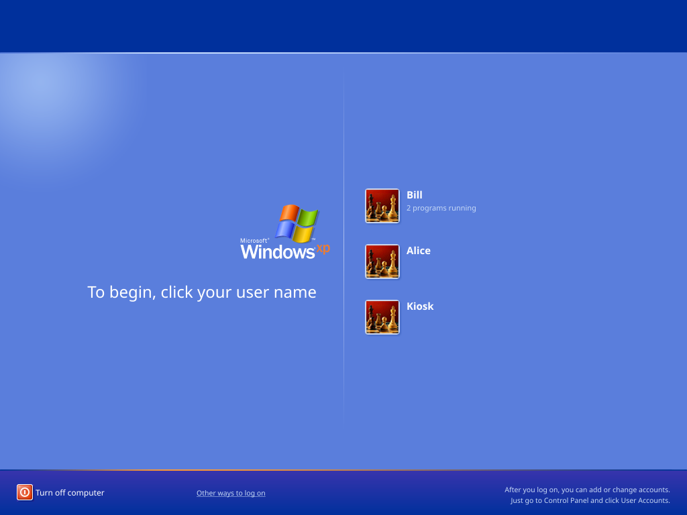

# XPLogin10

Real Windows XP welcome screen replacement for Windows 10/11. It operates as a native Credential Provider COM object loaded by `LogonUI.exe` on the secure Winlogon desktop, passing credentials directly to LSA.



> **Tested on:** Windows 10 21H2 x64 (Local Account).  
> **Warning:** Test in a Virtual Machine first before installing on a primary OS.

---

## How It Works

XPLogin10 replaces the stock logon UI using Windows' native Credential Provider architecture.

* **LSA Authentication:** XPLogin10 packs credentials into a standard `KERB_INTERACTIVE_UNLOCK_LOGON` buffer and hands it off to `LogonUI.exe`. Passwords are validated natively by Windows.
* **Native C++:** Runs entirely in native C++ using GDI+. No CLR hosting inside LogonUI.
* **Scope:** Replaces the sign-in screen and Win+L unlock screen. Does not modify shutdown/reboot screens (which are handled outside the window manager).

---

## Prerequisites & Building

- **OS:** Windows 10 1809+ or Windows 11 (x64)
- **Tools:** Visual Studio 2022 (C++ Desktop Workload), CMake 3.16+

### Build via PowerShell
```powershell
git clone [https://github.com/SubCoderHUN/XPLogin10.git](https://github.com/SubCoderHUN/XPLogin10.git)
cd XPLogin10
.\tools\Build.ps1
```

### Manual CMake Build

```powershell
cmake -S . -B build -A x64 -DXPLOGIN_BUILD_WIN32=ON
cmake --build build --config Release --parallel
cd build && ctest -C Release --output-on-failure
```
### Setup & Deployment
Run XPLogin10-Setup.exe (self-contained installer).
```powershell
# Safe first install (keeps stock Windows tiles available as fallback)
.\XPLogin10-Setup.exe /nofilter
```
### Useful Setup Flags
/silent - Unattended install
/nofilter - Keeps standard Windows logon tiles alongside XP screen
/nolockscreen - Preserves Windows 10 lock screen background
/nonumlock - Does not force Num Lock ON at startup

### Uninstallation & Recovery
To uninstall, use Settings > Apps > Installed apps, or run:
```powershell
"C:\Program Files\XPLogin10\XPLogin10-Setup.exe" /uninstall
```

### License & Credits
Created by SubCoderHUN
Repository: github.com/SubCoderHUN/XPLogin10

### Windows and Windows XP are trademarks of Microsoft Corporation. See NOTICE.md regarding asset licensing.
